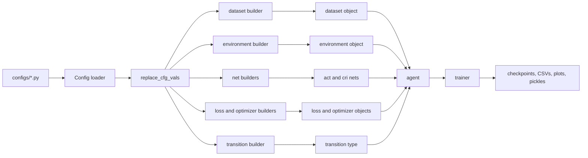
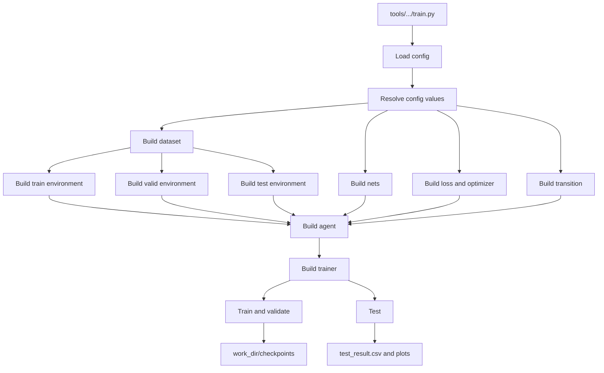
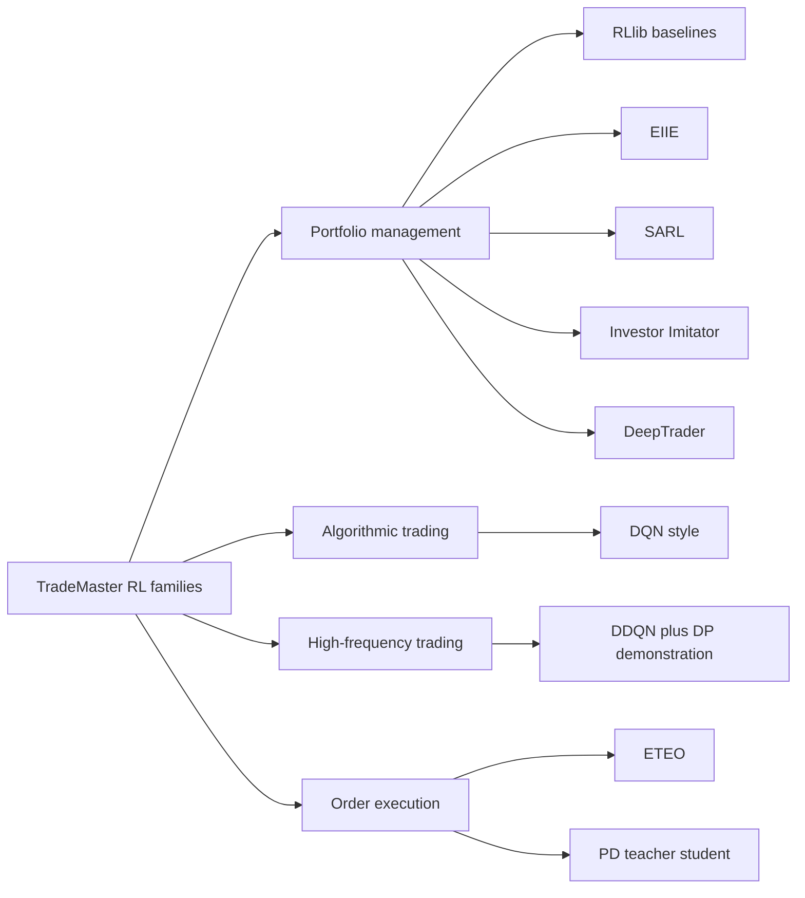
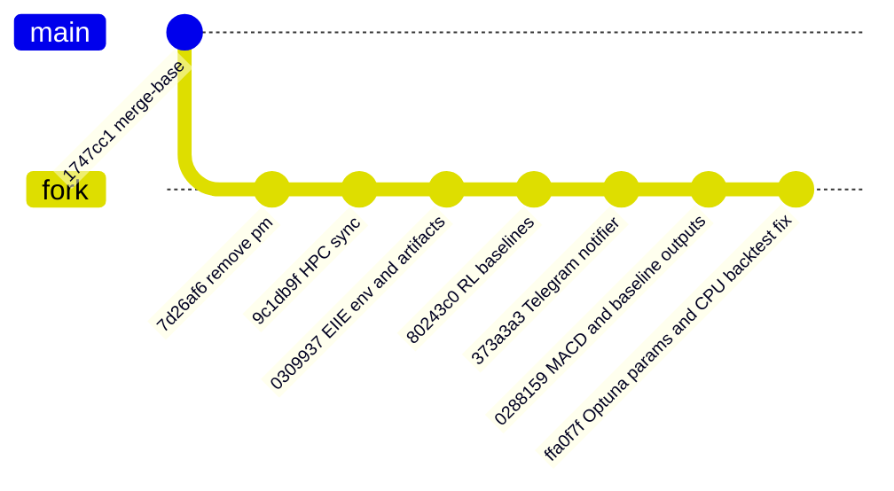

# TradeMaster Fork Codebase Guide

This document explains how the current `TradeMaster_fork` repository is structured, how the RL pipelines work, what this fork adds on top of upstream `TradeMaster`, and where the main correctness and maintainability risks are.

## Table of Contents
1. [Executive Summary](#executive-summary)
2. [Repository Layout](#repository-layout)
3. [Core Architecture](#core-architecture)
4. [How a Run Is Assembled](#how-a-run-is-assembled)
5. [How Reinforcement Learning Is Implemented](#how-reinforcement-learning-is-implemented)
6. [Portfolio Management](#portfolio-management)
7. [Algorithmic Trading](#algorithmic-trading)
8. [High-Frequency Trading](#high-frequency-trading)
9. [Order Execution](#order-execution)
10. [Other Subsystems](#other-subsystems)
11. [Fork History vs Upstream](#fork-history-vs-upstream)
12. [Assessment of Fork Additions](#assessment-of-fork-additions)
13. [Strengths](#strengths)
14. [Bugs and Risks](#bugs-and-risks)
15. [Overall Verdict](#overall-verdict)

## Executive Summary

- The core of the repo is the `trademaster/` package, which uses an `mmcv` config system plus registries and builders to assemble datasets, environments, agents, networks, optimizers, losses, replay buffers, and trainers.
- The main execution model is: `tools/.../train.py` loads a config, builders instantiate the runtime objects, and task-specific trainers handle training, validation, testing, checkpointing, and plotting.
- The repo is not a single RL implementation. It contains separate pipelines for portfolio management, algorithmic trading, high-frequency trading, order execution, market dynamics labeling, and missing-value imputation.
- The most heavily modified area in this fork is portfolio management. The fork adds custom NYSE and PSE datasets, a more realistic EIIE environment with PSE fee and board-lot logic, a new RL-baseline trainer path, and a Telegram notifier utility.
- The fork also adds a large amount of checked-in data, `work_dir` outputs, and package artifacts. Those additions make the repo harder to maintain and blur the line between source code and experiment output.
- Architecturally, the underlying platform is solid. The fork additions are directionally useful, but the implementation quality is uneven. There are several real bugs and several machine-specific path and dependency issues.

## Repository Layout

| Path | What it does |
| --- | --- |
| `trademaster/` | Core TradeMaster runtime code: datasets, environments, agents, nets, trainers, losses, optimizers, transitions, utilities, collectors, evaluation, preprocessing, imputation |
| `configs/` | Config files used to compose experiments. Most classic TradeMaster configs inherit from `configs/_base_/...` |
| `tools/` | CLI entrypoints for training, preprocessing, labeling, imputation, `finagent`, and `earnmore` |
| `data/` | Datasets and derived CSV splits |
| `finagent/` | Separate LLM and tool-augmented trading system built on `mmengine`, not the classic RL stack |
| `deploy/` | Backend service and related deployment code |
| `docs/`, `tutorial/`, `installation/` | Docs, notebooks, and install instructions |
| `unit_testing/` | Tests for some core components |
| `work_dir/` | Experiment outputs and fork-local artifacts |
| `scripts/` | Small operational utilities, currently including the Telegram notifier |

### `trademaster/`

This is the real engine room of the repository. Every major subsystem has a registry-backed `builder.py`. The runtime objects are intentionally decoupled: dataset objects mostly provide paths and metadata, environments interpret raw CSVs and implement trading simulation, networks define model architecture, agents define update rules and action sampling, and trainers own loops, validation, checkpointing, and reporting.

Important subdirectories inside `trademaster/` are:

| Path | Role |
| --- | --- |
| `trademaster/agents/` | Algorithm logic and parameter updates |
| `trademaster/datasets/` | Dataset wrappers and path resolution |
| `trademaster/environments/` | Trading simulators and reward logic |
| `trademaster/nets/` | Neural network architectures |
| `trademaster/trainers/` | Training, validation, testing, checkpointing |
| `trademaster/losses/` | Loss definitions |
| `trademaster/optimizers/` | Optimizer builders |
| `trademaster/transition/` | Transition type builders |
| `trademaster/utils/` | Shared helpers, replay buffers, config utilities, plotting, checkpoint IO |

### `configs/`

The classic TradeMaster part of the repo is very config-driven. Most configs specify objects such as `data`, `environment`, `trainer`, `act`, `cri`, `loss`, `optimizer`, and `transition`. The `_base_` directory holds reusable config fragments for datasets, environments, nets, trainers, losses, optimizers, and transitions.

Representative config locations:

| Path | Purpose |
| --- | --- |
| `configs/_base_/datasets/...` | Shared dataset fragments |
| `configs/_base_/environments/...` | Shared environment fragments |
| `configs/_base_/trainers/...` | Shared trainer fragments |
| `configs/portfolio_management/...` | Portfolio experiments |
| `configs/algorithmic_trading/...` | Algorithmic trading experiments |
| `configs/high_frequency_trading/...` | HFT experiments |
| `configs/order_execution/...` | Order execution experiments |
| `configs/finagent/...` | FinAgent configs |
| `configs/earnmore/...` | EarnMore configs |

### `tools/`

These scripts are the normal way to run the system. Examples include `tools/algorithmic_trading/train.py`, `tools/portfolio_management/train.py`, `tools/portfolio_management/train_eiie.py`, `tools/high_frequency_trading/train.py`, `tools/order_execution/train_eteo.py`, `tools/market_dynamics_labeling/run.py`, and `tools/missing_value_imputation/run.py`.

### `finagent/`

This is a parallel architecture, not just a helper module. It uses `mmengine.registry.Registry`, separate dataset, environment, provider, prompt, memory, and plot registries, and its own entrypoint in `tools/finagent/main.py`. It should be thought of as a separate product living inside the same repository.

### `tools/earnmore/` and `configs/earnmore/`

This is another separate portfolio-management stack. It imports `pm.registry` and `pm.utils`, which matters because the fork later deleted the `pm/` package. In the current state of the repo, this subsystem is not healthy.

## Core Architecture

The classic TradeMaster runtime is built around a simple idea: a config names the components, and builders turn those config blocks into Python objects.

The central utility is `trademaster/utils/utils.py`. This file provides:

| Function | Why it matters |
| --- | --- |
| `build_from_cfg` | Shared factory used by all builder modules |
| `replace_cfg_vals` | Resolves `${...}` placeholders inside configs |
| `set_seed` | Standard seed setup for Python, NumPy, and Torch |
| metric and plotting helpers | Reporting and visualization support |

The registry and builder pattern appears across the repo:

| Builder | Config block it consumes | Output |
| --- | --- | --- |
| `trademaster/datasets/builder.py` | `cfg.data` | dataset object |
| `trademaster/environments/builder.py` | `cfg.environment` | environment object |
| `trademaster/nets/builder.py` | `cfg.act`, `cfg.cri`, or other net blocks | neural net |
| `trademaster/agents/builder.py` | `cfg.agent` | agent object |
| `trademaster/trainers/builder.py` | `cfg.trainer` | trainer object |
| `trademaster/losses/builder.py` | `cfg.loss` | loss object |
| `trademaster/optimizers/builder.py` | `cfg.optimizer` | optimizer |
| `trademaster/transition/builder.py` | `cfg.transition` | transition type |

This architecture is useful because it keeps the system highly composable. The training scripts are thin, because most of the runtime behavior is delegated to configs and registries.

The tradeoff is that debugging can get harder when imports fail or when a config points at missing files. In this fork, that tradeoff becomes important because several failures are hidden until runtime.

## How a Run Is Assembled

The common runtime sequence looks like this:

1. A tool script loads a config with `mmcv.Config.fromfile(...)` or, in `finagent` and `earnmore`, `mmengine.config.Config.fromfile(...)`.
2. The config is normalized with `replace_cfg_vals(...)` so inherited or templated values are resolved.
3. A dataset object is built first. In most classic pipelines this object stores split paths, indicator names, and a few task-specific parameters.
4. One or more environments are built next. The environments usually do the real CSV loading and implement the trading simulator, state construction, reward function, and evaluation summaries.
5. Networks, optimizers, losses, and transitions are built from config.
6. An agent is built and receives the environment-facing dimensions plus the networks and optimizers.
7. A trainer is built and receives the dataset or environments plus the agent. The trainer then handles training, validation, testing, checkpointing, and output files under `work_dir/`.

Representative assembly scripts are:

| Entry point | What it wires together |
| --- | --- |
| `tools/algorithmic_trading/train.py` | dataset, train/valid/test envs, `act`, optional `cri`, optimizer, loss, transition, agent, trainer |
| `tools/high_frequency_trading/train.py` | dataset, separate train env and valid/test envs, HFT Q-net, DDQN agent, trainer |
| `tools/order_execution/train_eteo.py` | dataset, environments, continuous-action ETEO agent, trainer |
| `tools/order_execution/train_pd.py` | dataset, teacher/student PD agent, trainer |
| `tools/portfolio_management/train_eiie.py` | dataset, EIIE envs, actor/critic nets, agent, trainer |
| `tools/portfolio_management/train.py` | dataset and RLlib-based portfolio trainer |

Two design details matter a lot when understanding the codebase:

First, in the classic TradeMaster stack, dataset classes are often much thinner than their names suggest. They are usually metadata carriers, while the environment is the place that actually reads and interprets the market CSVs.

Second, trainers are not interchangeable wrappers around a single generic RL engine. Each task family has its own trainer logic, and some paths use custom RL code while others delegate to RLlib.

## How Reinforcement Learning Is Implemented

There is no single universal RL implementation in this repo. The repo mixes three different styles.

| Style | Where it appears | Description |
| --- | --- | --- |
| RLlib baseline integration | `trademaster/trainers/portfolio_management/trainer.py`, `trademaster/trainers/portfolio_management/sarl_trainer.py` | The repo delegates the RL algorithm to Ray RLlib and keeps local responsibility for environment design and experiment orchestration |
| Fully custom PyTorch RL | EIIE, algorithmic trading DQN, HFT DDQN, ETEO, PD | The repo defines its own networks, action selection logic, replay buffers, loss computation, and parameter updates |
| Non-RL adjacent systems | `finagent/`, imputation, market dynamics labeling | These are part of the wider platform but are not the classic RL training loop |

Across the custom RL paths, the common pattern is:

1. The environment defines the observation, action interpretation, reward, and episode summary.
2. The agent owns action selection and parameter updates.
3. The trainer owns data collection loops, validation cadence, checkpoint saving, and best-model selection.
4. Replay storage lives in `trademaster/utils/general_replay_buffer.py` or `trademaster/utils/replay_buffer.py`.
5. Checkpointing lives in `trademaster/utils/misc.py`.

The main replay implementations are:

| File | Used for |
| --- | --- |
| `trademaster/utils/general_replay_buffer.py` | Generic fixed-shape transition storage used by several custom trainers |
| `trademaster/utils/replay_buffer.py` | Older generic replay buffer and PER utilities |
| `trademaster/utils/replay_buffer.py` `ReplayBufferHFT` | HFT-specific replay with environment info and n-step support |

The main checkpoint helpers are `save_model`, `save_best_model`, `load_model`, and `load_best_model` in `trademaster/utils/misc.py`.

The next sections explain the task families one by one, because the details of state, action, reward, and learning differ substantially between them.

## Portfolio Management

Portfolio management is the most important area to understand in this fork because it has both the most code and the most fork-specific modifications.

There are two portfolio-management styles in the repo:

| Style | Main files | Notes |
| --- | --- | --- |
| RLlib baselines | `tools/portfolio_management/train.py`, `trademaster/trainers/portfolio_management/trainer.py`, `trademaster/environments/portfolio_management/environment.py` | Used for PPO, A2C, DDPG, PG, SAC, TD3 baselines |
| Custom algorithms | `train_eiie.py`, `train_sarl.py`, `train_investor_imitator.py`, `train_deeptrader.py` plus dedicated envs, agents, nets, trainers | EIIE is the most actively maintained custom path in this fork |

### Generic portfolio-management baseline path

The baseline environment is `trademaster/environments/portfolio_management/environment.py`.

Its main behavior is:

| Concept | Implementation |
| --- | --- |
| Data source | Reads a split CSV selected by task and filtered to the dataset's ticker universe |
| State | A matrix shaped like `(num_features, stock_dim)` built from current-day features only |
| Action | A length `stock_dim + 1` vector for `cash + assets` |
| Action normalization | Softmax inside the environment |
| Reward | Change in total portfolio value after transaction-cost penalty |
| Accounting | Keeps asset history, return history, date history, and transaction-cost history |

This environment tries to stabilize the ticker dimension across train, valid, and test by using the `PortfolioManagementDataset` ticker universe. That is a sensible design goal, because otherwise the shape of the observation would drift between splits.

The matching trainer is `trademaster/trainers/portfolio_management/trainer.py`. That trainer is not a custom PPO implementation. Instead, it selects an RLlib algorithm class, registers the environment, trains through RLlib, then runs validation and test rollouts directly on the local environment. This is a hybrid design: RLlib owns the optimization, but the repo still owns evaluation and result export.

### `PortfolioManagementDataset`

The forked `trademaster/datasets/portfolio_management/dataset.py` does several useful things:

| Responsibility | Implementation |
| --- | --- |
| Path resolution | Converts relative paths to repo-root-based absolute paths |
| Stable universe | Computes the intersection of tickers present in train, valid, and test |
| Environment parameters | Stores initial capital, transaction costs, fee model, thresholds, and PSE fee settings |

This dataset refactor is directionally good. It is one of the better ideas in the fork because it makes cross-split portfolio experiments more consistent.

### EIIE

The EIIE path is the strongest custom RL pipeline in the fork.

Main files:

| Component | File |
| --- | --- |
| Entry point | `tools/portfolio_management/train_eiie.py` |
| Environment | `trademaster/environments/portfolio_management/eiie_environment.py` |
| Nets | `trademaster/nets/eiie.py` |
| Agent | `trademaster/agents/portfolio_management/eiie.py` |
| Trainer | `trademaster/trainers/portfolio_management/eiie_trainer.py` |

EIIE differs from the generic baseline path in several important ways:

| Concept | Implementation |
| --- | --- |
| State | A rolling time window shaped per ticker, not just current-day features |
| Action | Portfolio weights including cash |
| Reward | Log change in portfolio value |
| Learning | Custom PyTorch actor-critic with a replay buffer |
| Extra realism | PSE fee schedule, board-lot rounding, daily turnover quotas, and trade-count quotas |

The EIIE actor is `EIIEConv` in `trademaster/nets/eiie.py`. It uses convolutions across indicator and time dimensions, then appends a learnable cash bias term before softmax normalization.

The EIIE environment in this fork is the most domain-specific simulator in the repo's classic portfolio-management code. It contains:

| Feature | Why it matters |
| --- | --- |
| `_get_pse_board_lot(...)` | Converts price to board-lot and tick-size constraints |
| `_apply_board_lot_rounding(...)` | Converts target weights into executable lots |
| `_pse_transaction_fee(...)` | Applies commission, VAT, PSE fee, SCCP fee, and STT |
| daily turnover and trade-count tracking | Tries to enforce execution realism |
| fee and board-lot diagnostics memory | Makes debugging and analysis possible |

This is the part of the fork where the ideas are strongest. It is also where several of the fork's most important bugs live, discussed later.

### SARL

The SARL path is a mix of custom feature engineering and RLlib training.

Main files:

| Component | File |
| --- | --- |
| Entry point | `tools/portfolio_management/train_sarl.py` |
| Environment | `trademaster/environments/portfolio_management/sarl_environment.py` |
| Net | `trademaster/nets/sarl.py` |
| Trainer | `trademaster/trainers/portfolio_management/sarl_trainer.py` |

The key idea is that SARL enriches the state with a pretrained LSTM-based stock representation, then uses RLlib for the RL algorithm itself. So the custom part is mostly the state encoder and environment design, not the policy optimization code.

### Investor Imitator

The investor-imitator path is more specialized. It uses pretrained descriptor models and treats the policy decision as a discrete choice over descriptor families.

Main files:

| Component | File |
| --- | --- |
| Entry point | `tools/portfolio_management/train_investor_imitator.py` |
| Environment | `trademaster/environments/portfolio_management/inverstor_imitator_environment.py` |
| Nets | `trademaster/nets/investor_imitator.py` |
| Agent | `trademaster/agents/portfolio_management/investor_imitator.py` |

Conceptually, this is closer to policy-gradient style selection over expert signals than to a standard continuous-action portfolio allocator.

### DeepTrader

DeepTrader is present in the codebase but does not look reliable in the current repo state.

The path is spread across `tools/portfolio_management/train_deeptrader.py`, `trademaster/agents/portfolio_management/deeptrader.py`, `trademaster/nets/deeptrader.py`, and `trademaster/trainers/portfolio_management/deeptrader_trainer.py`.

The important practical takeaway is simple: treat DeepTrader as stale code unless you repair it first. The current implementation contains mismatched trainer and agent APIs and even a hard `exit()` inside the agent exploration path.

## Algorithmic Trading

The algorithmic-trading path is a single-asset DQN-style setup built around DeepScalper-like logic.

Main files:

| Component | File |
| --- | --- |
| Entry point | `tools/algorithmic_trading/train.py` |
| Dataset | `trademaster/datasets/algorithmic_trading/dataset.py` |
| Environment | `trademaster/environments/algorithmic_trading/environment.py` |
| Net | `trademaster/nets/dqn.py` |
| Agent | `trademaster/agents/algorithmic_trading/dqn.py` |
| Trainer | `trademaster/trainers/algorithmic_trading/trainer.py` |

The environment is simpler than portfolio management because it is a single-asset problem.

| Concept | Implementation |
| --- | --- |
| State | Flattened rolling indicators over `backward_num_day`, plus current cash and current holdings |
| Action | Discrete integer in `0 .. 2 * max_volume`, interpreted as a position change around zero |
| Reward | Hindsight-shaped reward using both current and future price movement |
| Episode summary | Return, asset curve, buy-and-hold baseline, volatility estimate |

The agent is a standard off-policy DQN structure. It uses a target network, a generic replay buffer, MSE loss for TD targets, and soft target updates. The trainer handles the warm-up rollout, repeated environment exploration, periodic validation, checkpoint saving, and final test export.

A notable design choice is that the reward explicitly looks ahead through `future_weights`. That is not a pure realized-next-step trading reward; it is reward shaping with future information.

## High-Frequency Trading

The HFT path is one of the more interesting RL designs in the repo. It is not just DDQN on a limit-order-book state. It adds action masks and an imitation term derived from a dynamic-programming expert.

Main files:

| Component | File |
| --- | --- |
| Entry point | `tools/high_frequency_trading/train.py` |
| Dataset | `trademaster/datasets/high_frequency_trading/dataset.py` |
| Environment | `trademaster/environments/high_frequency_trading/environment.py` |
| Net | `trademaster/nets/high_frequency_trading_dqn.py` |
| Agent | `trademaster/agents/high_frequency_trading/ddqn.py` |
| Loss | `trademaster/losses/hft_loss.py` |
| Trainer | `trademaster/trainers/high_frequency_trading/trainer.py` |

Its core design is:

| Concept | Implementation |
| --- | --- |
| State | Flattened stack of LOB-derived features |
| Action | Discrete target position level |
| Extra inputs | Previous action and an available-action mask |
| Reward | Mark-to-market trading reward based on executable price levels |
| Supervision | Dynamic-programming expert action distribution in `DP_action` |
| Learning loss | TD loss plus KL divergence toward the expert distribution |

The environment precomputes a multi-level dynamic-programming demonstration policy. During training, the agent samples replay batches that include both ordinary RL transition data and environment-side info such as `previous_action`, `avaliable_action`, and `DP_action`.

This is a nice example of a hybrid learning design: value-based RL plus supervised guidance.

## Order Execution

Order execution has two main algorithm families in this repo: ETEO and PD.

### ETEO

Main files:

| Component | File |
| --- | --- |
| Entry point | `tools/order_execution/train_eteo.py` |
| Environment | `trademaster/environments/order_execution/eteo_environment.py` |
| Net | `trademaster/nets/eteo.py` |
| Agent | `trademaster/agents/order_execution/eteo.py` |
| Trainer | `trademaster/trainers/order_execution/eteo_trainer.py` |

ETEO is a continuous-action execution policy.

| Concept | Implementation |
| --- | --- |
| State | Public LOB features plus private state for time left and order left |
| Action | Two-dimensional continuous action: volume and price |
| Environment mechanics | Maintains explicit outstanding limit orders and portfolio bookkeeping |
| Reward | Mostly terminal and benchmarked against TWAP |
| Learning | PPO-like clipped objective implemented inside the agent |

This path is interesting because the environment simulates order placement and partial execution rather than simple immediate trading.

### PD

Main files:

| Component | File |
| --- | --- |
| Entry point | `tools/order_execution/train_pd.py` |
| Environment | `trademaster/environments/order_execution/pd_environment.py` |
| Net | `trademaster/nets/pd.py` |
| Agent | `trademaster/agents/order_execution/pd.py` |
| Trainer | `trademaster/trainers/order_execution/pd_trainer.py` |

PD stands out because it explicitly uses a teacher and a student policy.

| Concept | Implementation |
| --- | --- |
| Perfect state | A larger observation window used by the teacher |
| Imperfect state | The smaller observation available to the student |
| Private state | Remaining time and remaining order |
| Learning | PPO-style updates for teacher and student plus KL distillation from teacher to student |

This is a teacher-student order-execution pipeline rather than a plain single-policy RL algorithm.

## Other Subsystems

Not everything in the repo is part of the classic RL training loop.

### Market dynamics labeling

The market-dynamics tools under `tools/market_dynamics_labeling/` create labeled market-regime slices used by `dynamics_test` style workflows. Several dataset classes for classic RL tasks can also materialize sliced CSVs for these dynamic tests.

### Missing-value imputation

The imputation code under `trademaster/imputation/` and `tools/missing_value_imputation/run.py` is a separate modeling path for filling missing financial data, not a trading policy learner.

### FinAgent

`finagent/` is a separate stack built around providers, prompts, memory, query diversification, and tool-using strategy agents. Its entrypoint is `tools/finagent/main.py`. It uses `mmengine`, not the classic `mmcv` stack. It should be understood as a separate AI trading workflow living in the same monorepo.

### EarnMore

`tools/earnmore/` and `configs/earnmore/` represent yet another portfolio-management code path. It is built around `pm.registry`, vectorized Gym environments, TensorBoard logging, and its own replay buffer and checkpoint helpers. In the current fork, this stack is broken because `pm/` was removed while the `tools/earnmore/*.py` scripts still import it.

### Deploy and collectors

`deploy/` exposes backend service code, while `trademaster/collector/` contains data-collection helpers. These are useful platform features, but they are not part of the core RL training loops discussed above.

## Fork History vs Upstream

I compared the current branch against `upstream/1.0.0`. The current fork diverges from the upstream history after the merge-base commit `1747cc1`, and the fork-only range currently contains seven commits.

Here is what each fork-only commit meaningfully contributed.

| Commit | Main change | Practical meaning |
| --- | --- | --- |
| `7d26af6` | Removed the `pm/` package and `test_function.py`; massively changed `.gitignore` | This broke the later `tools/earnmore/*.py` scripts because they still import `pm.*` |
| `9c1db9f` | Large portfolio-management sync from an HPC environment | Main source rewrite in this fork: dataset alignment, new PM env logic, RL baseline trainer changes, requirements changes |
| `0309937` | Expanded EIIE environment and added custom NYSE and PSE datasets plus reporting artifacts | This is the commit that introduced most of the board-lot and PSE-fee work |
| `80243c0` | Added RL baselines for portfolio management | Introduced the generic `tools/portfolio_management/train.py` baseline path and committed `work_dir` and package artifacts |
| `373a3a3` | Added Telegram notifier | Small operational utility; useful but not fully dependency-wired |
| `0288159` | Added MACD, Markowitz, and ZMR outputs | Mostly checked-in result artifacts rather than source code |
| `ffa0f7f` | Added more portfolio datasets and a small EIIE trainer change | Large artifact and dataset check-in with only a small amount of source change |

The important pattern is that only a subset of the fork-only commits are really source-code feature work. A large fraction of the diff is checked-in data, checkpoints, reports, and `work_dir` output.

## Assessment of Fork Additions

The fork is not uniformly good or bad. It contains a mix of thoughtful domain additions and fragile execution details.

| Area | Status | Assessment |
| --- | --- | --- |
| Portfolio dataset alignment | Mixed | Good idea and necessary for stable portfolio shapes, but the downstream environment fill logic has a correctness bug |
| EIIE PSE realism | Mixed | Strong direction and richer market realism, but quota accounting and some config knobs are inconsistent |
| RLlib portfolio baselines | Weak | Useful in concept, but the dependency and config path wiring are not production-ready |
| Telegram notifier | Good but incomplete | Small and useful utility, but docs and requirements do not fully match |
| Checked-in baseline artifacts | Weak | Fine for local reference, but not a good long-term source-control practice |
| EarnMore in this fork | Broken | The entrypoints still import `pm.*` after `pm/` was removed |

## Strengths

- The core `mmcv` config plus registry architecture is still one of the best parts of the repository. It keeps experiments composable and makes the codebase easier to extend.
- The repo covers a genuinely broad range of trading problems. This is not a toy example repo; it contains several distinct simulators and learning setups.
- The HFT pipeline is technically interesting because it combines RL with dynamic-programming demonstrations and an imitation term.
- The EIIE environment fork work adds real market-structure ideas instead of just cosmetic changes. Board-lot rounding, tax and fee schedules, and turnover constraints are the right kind of realism to add to a trading simulator.
- The dataset-universe alignment idea in `PortfolioManagementDataset` is sensible and addresses a real problem in cross-split portfolio experiments.
- The repo preserves enough separation between datasets, environments, agents, and trainers that focused repairs are possible without rewriting the whole platform.

## Bugs and Risks

The most important issues I found are below, ordered roughly by severity and impact.

1. The portfolio-management baseline environment corrupts missing-ticker features instead of carrying forward the same ticker's prior values.
   File: `trademaster/environments/portfolio_management/environment.py`, around the `fillna(method="ffill")` block.
   Impact: when a ticker is missing on a day, its features can be filled from another ticker's row for that same day. That contaminates observations on the fork's custom aligned portfolio datasets.

2. The RL baseline path does not line up with the repo's own dependency specification.
   Files: `trademaster/trainers/portfolio_management/trainer.py`, `requirements.txt`.
   Impact: the trainer imports `gymnasium` and `ray.rllib.algorithms.*`, but `requirements.txt` comments out `gymnasium` and pins `ray[rllib]==1.13.0`, which historically uses a different import surface. A clean install is unlikely to run this path successfully.

3. The default portfolio-management baseline entrypoint points to a config file that is not actually present in `configs/`.
   File: `tools/portfolio_management/train.py`.
   Impact: the default command fails immediately unless the caller manually overrides `--config`.

4. The fork deleted the `pm/` package, but EarnMore still imports it.
   Files: commit `7d26af6`, `tools/earnmore/train.py`.
   Impact: the current EarnMore entrypoints are dead in this fork.

5. Portfolio `dynamics_test` support is broken after the dataset refactor.
   Files: `trademaster/datasets/portfolio_management/dataset.py`, `tools/portfolio_management/train_eiie.py`, `trademaster/trainers/portfolio_management/sarl_trainer.py`.
   Impact: the code still expects `dataset.test_dynamic_paths`, but the dataset no longer builds that attribute.

6. Turnover and trade-count quotas in the EIIE environment are applied before board-lot rounding.
   File: `trademaster/environments/portfolio_management/eiie_environment.py`.
   Impact: tiny orders that later round to zero can still consume daily turnover quota or daily trade slots. That makes the execution realism internally inconsistent.

7. Some EIIE dataset knobs are effectively dead.
   Files: `trademaster/datasets/portfolio_management/dataset.py`, `trademaster/environments/portfolio_management/eiie_environment.py`.
   Impact: the environment reads `use_board_lot` and `pse_fee_vat_rate`, but the dataset class never stores them, so configs cannot reliably override those values.

8. Several trainer imports intentionally swallow exceptions.
   Files: `trademaster/trainers/__init__.py`, `trademaster/trainers/portfolio_management/__init__.py`.
   Impact: real dependency or import failures become silent `None` placeholders, which makes runtime diagnosis much harder.

9. The EIIE trainer writes the test CSV to an incorrect path expression.
   File: `trademaster/trainers/portfolio_management/eiie_trainer.py`.
   Impact: `os.path.join(self.work_dir + "test_result.csv")` concatenates the filename directly onto the directory string instead of joining as a child path.

10. The new portfolio configs are hardwired to one HPC filesystem.
    Files: `configs/portfolio_management/portfolio_management_exchange_ppo_ppo_adam_mse.py`, `work_dir/portfolio_management_dj30_ppo_ppo_adam_mse_fg/PPO_nyse_custom.py`.
    Impact: several new configs refer to `/mnt/lustre/...` absolute paths even though the repository also contains local copies of the data.

11. The board-lot verification material is internally inconsistent.
    Files: `test_board_lot.py`, `BOARD_LOT_VERIFICATION.md`, `trademaster/environments/portfolio_management/eiie_environment.py`.
    Impact: the verification script and the actual environment disagree about the lot size for the `50.000 - 99.950` price range, so the validation story is weaker than the markdown report implies.

12. The Telegram notifier is useful but not fully wired into the repo's dependency story.
    Files: `scripts/telegram_notifier.py`, `docs/telegram_notifier.md`, `requirements.txt`.
    Impact: the code depends on `requests`, and the docs claim it is already in requirements, but the current `requirements.txt` does not include it.

13. `summarize_results.py` is written against a local path convention that does not match the current repo layout.
    File: `summarize_results.py`.
    Impact: it expects `TradeMaster/workdir` instead of this repo's `work_dir/`, so it is not a reliable general reporting script.

14. DeepTrader looks stale and partially broken.
    Files: `trademaster/agents/portfolio_management/deeptrader.py`, `trademaster/trainers/portfolio_management/deeptrader_trainer.py`.
    Impact: it contains an `exit()` in the agent exploration path and mismatched trainer and agent interfaces. I would not trust it without repair.

15. A large share of the fork diff is made of checked-in datasets, checkpoints, `egg-info`, plots, and `work_dir` outputs.
    Impact: this makes the repo heavier, increases review noise, and makes it harder to separate source changes from experiment artifacts.

## Overall Verdict

The codebase itself is real and worth understanding. The core TradeMaster design still makes sense, and the RL implementations are substantial rather than superficial.

The fork, however, should be treated as an experimental branch rather than a polished extension of upstream. The strongest fork additions are the portfolio-management realism work in the EIIE environment and the attempt to support more realistic custom datasets. The weakest parts are the baseline wiring, portability, dependency hygiene, and the amount of checked-in artifact data.

If the question is, "Do we have a good implementation of the additional features?", my answer is: partly, but not yet reliably. The ideas are good. The current implementation still has several correctness bugs and several runtime blockers that should be fixed before treating the fork as stable.
