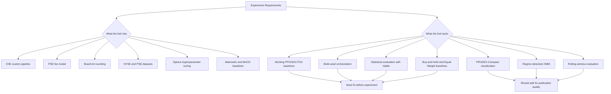
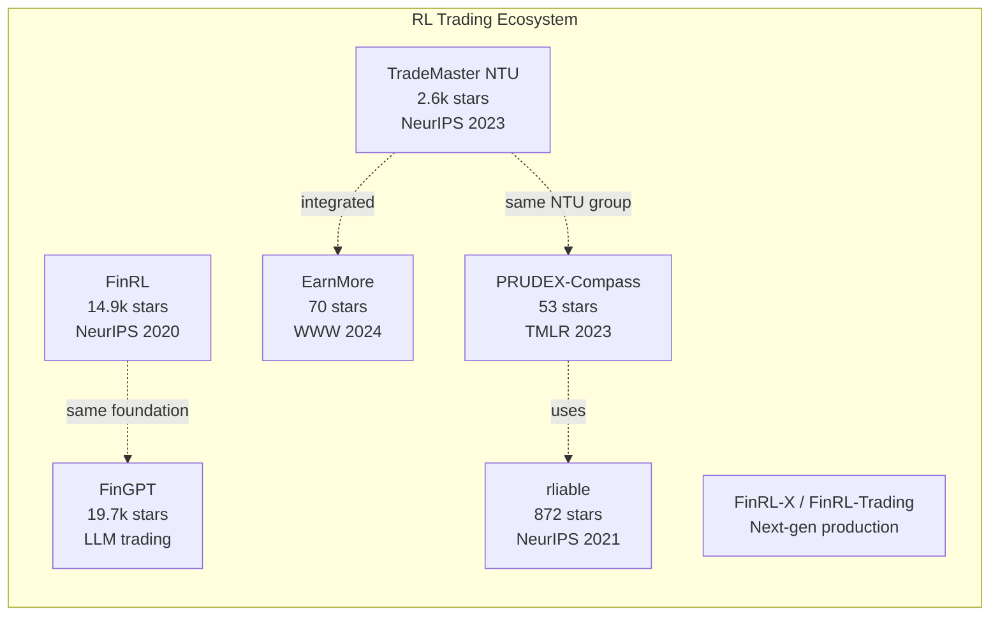
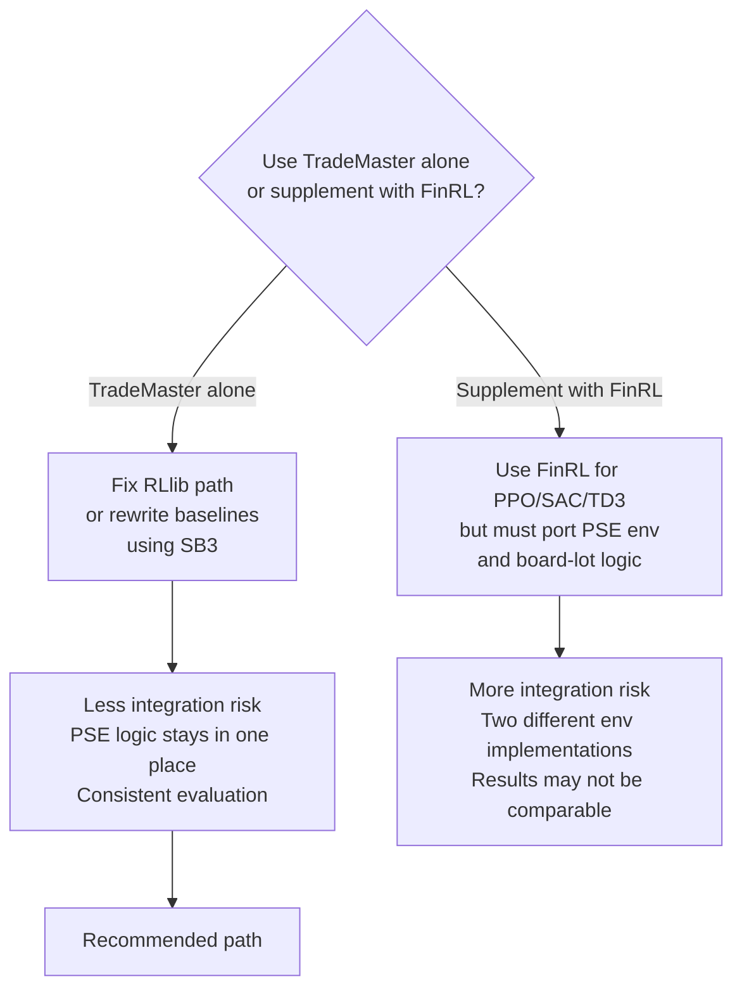
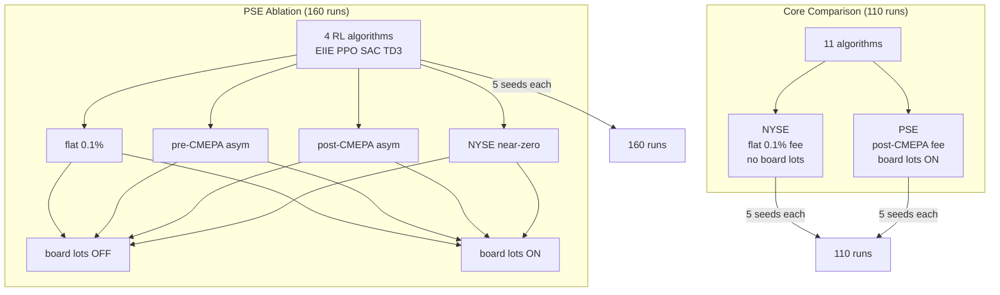
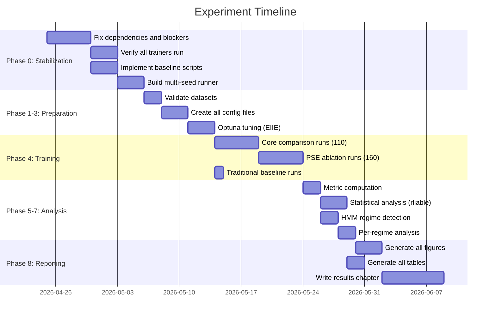

# Experiment Readiness Analysis: RL Portfolio Management on the Philippine Stock Exchange

This document assesses whether the current TradeMaster fork can execute the thesis experiment described in the deep research plan, identifies gaps, compares against the broader RL trading ecosystem, and provides actionable recommendations.

## Table of Contents

1. [Executive Summary](#executive-summary)
2. [The Experiment in Brief](#the-experiment-in-brief)
3. [Landscape of Similar Repositories and Frameworks](#landscape-of-similar-repositories-and-frameworks)
4. [What This Fork Already Provides](#what-this-fork-already-provides)
5. [Requirement-by-Requirement Readiness Assessment](#requirement-by-requirement-readiness-assessment)
6. [Critical Gaps That Block the Experiment](#critical-gaps-that-block-the-experiment)
7. [Gaps That Weaken But Do Not Block the Experiment](#gaps-that-weaken-but-do-not-block-the-experiment)
8. [Should You Use Only TradeMaster or Supplement with FinRL](#should-you-use-only-trademaster-or-supplement-with-finrl)
9. [Recommended Fix and Build Sequence](#recommended-fix-and-build-sequence)
10. [Risk Register](#risk-register)
11. [Overall Verdict](#overall-verdict)
12. [Detailed Experiment Plan](#detailed-experiment-plan)
    - [Phase 0: Codebase Stabilization](#phase-0-codebase-stabilization)
    - [Phase 1: Data Pipeline](#phase-1-data-pipeline)
    - [Phase 2: Experiment Design Matrix](#phase-2-experiment-design-matrix)
    - [Phase 3: Config File Specification](#phase-3-config-file-specification)
    - [Phase 4: Training Protocol](#phase-4-training-protocol)
    - [Phase 5: Evaluation and Metrics](#phase-5-evaluation-and-metrics)
    - [Phase 6: Statistical Analysis](#phase-6-statistical-analysis)
    - [Phase 7: Regime Analysis](#phase-7-regime-analysis)
    - [Phase 8: Visualization and Reporting](#phase-8-visualization-and-reporting)
    - [Phase 9: Compute Budget Estimate](#phase-9-compute-budget-estimate)
    - [Phase 10: Timeline](#phase-10-timeline)

## Executive Summary

**You are in a reasonable but not yet ready position to run the full experiment using only this TradeMaster fork.** The fork has genuine strengths: PSE fee modeling, board-lot rounding, custom aligned datasets, and a working EIIE pipeline. But it has critical gaps in three areas: the RLlib baseline trainer path is broken, there is no multi-seed experiment orchestration, and there is no statistical evaluation infrastructure. Fixing these is necessary before the experiment can begin.

The good news is that all of the gaps are fixable within TradeMaster without switching platforms. The recommended path is to repair the existing code rather than migrating to FinRL or another framework, because TradeMaster already contains the PSE-specific domain logic that no other framework has.



## The Experiment in Brief

The deep research describes a thesis experiment with these key requirements:

| Dimension | What is needed |
| --- | --- |
| **Markets** | NYSE (DJ30 or similar) vs PSE (PSEi top 30), same experiment on both |
| **RL algorithms** | EIIE + PPO + SAC + TD3 at minimum |
| **Traditional baselines** | Buy-and-Hold, Equal Weight (1/N), Markowitz, CRP, MACD, Z-Score Mean Reversion |
| **Cost modeling** | Asymmetric PSE fees (~0.30% buy, ~0.40% sell), pre/post-CMEPA comparison, near-zero NYSE costs |
| **Board lots** | PSE price-dependent board-lot constraints as an independent variable |
| **Evaluation metrics** | ARR, Sharpe, Sortino, Calmar, MDD, annualized volatility (EarnMore standard set) |
| **Statistical rigor** | 5+ random seeds per config, Welch's t-test, performance profiles via `rliable` |
| **Regime analysis** | HMM-based 3-state regime detection, metrics reported per regime |
| **Visualization** | PRUDEX-Compass spider diagrams |
| **Data split** | 2008-2017 train, 2018-2019 valid, 2020-2025 test |

## Landscape of Similar Repositories and Frameworks

Before assessing this fork, it helps to understand what else exists. The deep research references several frameworks. Here is how they compare:



### TradeMaster (upstream, 2.6k stars)

- **Strengths**: Broadest coverage of RL trading tasks (portfolio, algorithmic, HFT, order execution). Built-in PRUDEX-Compass evaluation. Contains EIIE, SARL, DeepTrader, Investor Imitator, plus RLlib baselines. NeurIPS 2023 publication.
- **Weaknesses**: Pinned to old Ray 1.13.0 and mmcv 1.7.1. Some paths stale. The `pm/` package for EarnMore and some newer additions feel bolted on rather than integrated.
- **Relevance to thesis**: This is the right platform for this experiment because it already has the portfolio-management environment architecture, EIIE, and the PRUDEX evaluation tools. No other framework has all three.

### FinRL (14.9k stars)

- **Strengths**: Much larger community. Clean Stable-Baselines3 integration for A2C, DDPG, PPO, TD3, SAC. Better dependency hygiene. More data source connectors. Now has a next-gen "FinRL-X" for production use.
- **Weaknesses**: No PSE support. No board-lot modeling. No PRUDEX-Compass. No EIIE implementation. Portfolio environment is simpler than TradeMaster's. No asymmetric fee model.
- **Relevance to thesis**: FinRL could provide the multi-algorithm baselines (PPO, SAC, TD3) more easily, but integrating PSE fee logic into FinRL would require building a custom environment from scratch. That is more work than fixing TradeMaster's RLlib path.

### EarnMore (DVampire/EarnMore, 70 stars, WWW 2024)

- **Strengths**: The paper defines the 6-metric standard (ARR, SR, SoR, CR, MDD, AV) the deep research recommends. Maskable stock representation for customizable pools. Has its own `pm/` package with DQN, PPO, SAC, DDPG, TD3 agents.
- **Weaknesses**: Standalone repo with its own dependencies (mmengine, qlib). Integration into TradeMaster upstream is incomplete. In this fork, `pm/` was deleted, breaking the EarnMore path entirely.
- **Relevance to thesis**: The EarnMore metric set is the right target. But running EarnMore itself from this fork is not currently possible.

### PRUDEX-Compass (53 stars, TMLR 2023)

- **Strengths**: Defines the 6-axis, 17-measure evaluation framework the deep research references. Provides LaTeX/TikZ generation for compass diagrams, performance profiles via `rliable`, rank distributions, and extreme-market analysis.
- **Weaknesses**: It is a visualization and evaluation toolkit, not a training framework. Requires pre-computed metric arrays.
- **Relevance to thesis**: This should be used as a post-hoc evaluation tool. It can consume TradeMaster's output CSVs and produce publication-quality figures.

### FinGPT (19.7k stars)

- **Strengths**: Open-source financial LLM. Sentiment analysis models on HuggingFace. FinGPT-Forecaster for stock prediction. Can fine-tune on a single RTX 3090.
- **Weaknesses**: Not a portfolio management system. Outputs sentiment signals, not portfolio allocations. Requires separate integration work to use as a trading baseline.
- **Relevance to thesis**: Could serve as the optional LLM baseline the deep research suggests, but it is lower priority.

### rliable (872 stars, NeurIPS 2021 Outstanding Paper)

- **Strengths**: Provides exactly the statistical tools the deep research demands: stratified bootstrap CIs, IQM, performance profiles, probability of improvement.
- **Weaknesses**: Archived by Google as of Oct 2025. Still installable and functional.
- **Relevance to thesis**: Essential for the statistical evaluation layer. Should be added as a dependency.

## What This Fork Already Provides

Mapping the fork's current capabilities against the experiment plan:

| Requirement | Fork status | Where it lives |
| --- | --- | --- |
| EIIE portfolio management | Working | `tools/portfolio_management/train_eiie.py`, full pipeline |
| PSE asymmetric fee model | Implemented | `trademaster/environments/portfolio_management/eiie_environment.py:489-554` |
| Board-lot rounding | Implemented | `trademaster/environments/portfolio_management/eiie_environment.py:409-487` |
| PSE dataset (aligned 30 stocks) | Present | `data/portfolio_management/pse_aligned30/`, `pse_top30_2008_2025/` |
| NYSE dataset (aligned 30 stocks) | Present | `data/portfolio_management/nyse_ohlc_aligned30/`, `nyse_ohlc_aligned30_2008_2025/` |
| Markowitz baseline outputs | Present | `work_dir/portfolio_management_*_markowitz/` |
| MACD baseline outputs | Present | `work_dir/portfolio_management_*_markowitz/macd_*.csv` |
| Z-Score Mean Reversion outputs | Present | `work_dir/portfolio_management_*_zmr/` |
| Optuna hyperparameter search | Partially present | `tools/algorithmic_trading/auto_train.py`, `optuna` in `requirements.txt` |
| Ticker universe alignment | Working | `trademaster/datasets/portfolio_management/dataset.py:56-72` |
| Telegram notifier for HPC jobs | Working | `scripts/telegram_notifier.py` |
| Pre/post CMEPA fee parameters | Configurable | STT rate and cutoff date are config-driven in the EIIE environment |

## Requirement-by-Requirement Readiness Assessment

### High-Priority Requirements (Essential)

| # | Requirement | Ready? | Details |
| --- | --- | --- | --- |
| 1 | EIIE on PSE and NYSE | Partly | EIIE pipeline works. PSE fee model and board lots are implemented. But there are bugs in quota accounting and some dead config knobs (see `CODEBASE_GUIDE.md`). |
| 2 | PPO baseline | Not ready | The `PortfolioManagementTrainer` imports `ray.rllib.algorithms.ppo.PPO`, but `requirements.txt` pins `ray[rllib]==1.13.0` which uses a different API. The default config points to a missing file. |
| 3 | SAC baseline | Not ready | Same dependency mismatch as PPO. |
| 4 | TD3 baseline | Not ready | Same dependency mismatch as PPO. |
| 5 | A2C baseline | Not ready | Same dependency mismatch as PPO. |
| 6 | Buy-and-Hold baseline | Partial | Some output CSVs exist in `work_dir/`, but there is no reusable script that produces B&H metrics in the standard format. |
| 7 | Equal Weight (1/N) baseline | Not present | No implementation. |
| 8 | 5+ random seeds per config | Not present | No multi-seed orchestration. The training scripts use a single fixed seed. |
| 9 | Asymmetric PSE costs | Implemented | Commission, VAT, PSE fee, SCCP, STT all modeled separately for buy and sell sides. |
| 10 | Board-lot as IV | Implemented | `use_board_lot` flag in the EIIE environment. Configurable per run. |
| 11 | Standard evaluation metrics | Partial | The code computes TR, Sharpe, Vol, MDD, CR, SoR. Missing: annualized volatility as a standalone metric in the EarnMore sense, and no systematic output format for cross-comparison. |

### Medium-Priority Requirements (Strengthen Contribution)

| # | Requirement | Ready? | Details |
| --- | --- | --- | --- |
| 12 | Regime detection (HMM) | Not present | No HMM implementation. The upstream `dynamics_test` path exists but is broken in this fork. |
| 13 | Rolling window evaluation | Not present | The trainer runs a single train/valid/test split. No rolling-window support. |
| 14 | PRUDEX-Compass visualization | Not present locally | The upstream `PRUDEX-Compass` repo exists separately and can generate diagrams from JSON, but no integration code exists in this fork. |
| 15 | Performance profiles via rliable | Not present | `rliable` is not in requirements and no code uses it. |
| 16 | CRP baseline | Not present | No Constant Rebalanced Portfolio implementation. |
| 17 | Pre/post CMEPA comparison | Configurable | The STT rate and cutoff date are parameters in the EIIE environment, so running two configs with different rates is possible. |

### Lower-Priority Requirements (Nice to Have)

| # | Requirement | Ready? | Details |
| --- | --- | --- | --- |
| 18 | LLM baseline (FinGPT) | Not present | FinAgent exists in the repo but is a separate stack, not integrated with the portfolio-management evaluation pipeline. |
| 19 | Survivorship bias check | Not addressed | No historical PSEi constituent list handling. |
| 20 | Alpha decay analysis | Not present | No temporal performance decay analysis code. |

## Critical Gaps That Block the Experiment

These must be fixed before any experiment runs can begin.

### Gap 1: The RLlib baseline trainer is broken

**What is wrong**: `trademaster/trainers/portfolio_management/trainer.py` imports from `ray.rllib.algorithms.*` (Ray 2.x+ API), but `requirements.txt` pins `ray[rllib]==1.13.0` (which uses `ray.rllib.agents.*`). Additionally, `gymnasium` is commented out in requirements but imported by the trainer.

**Impact**: PPO, SAC, TD3, A2C, DDPG, PG baselines cannot run from a clean install.

**Fix options**:
1. **Option A (Recommended)**: Update `requirements.txt` to a modern Ray version (e.g., `ray[rllib]>=2.6`) and `gymnasium>=0.28`, then test the trainer. This is the path of least resistance given the trainer code already uses the new API.
2. **Option B**: Rewrite the baselines using Stable-Baselines3 instead of RLlib. This gives more control and matches FinRL's approach, but requires more code.
3. **Option C**: Downgrade the trainer code back to `ray.rllib.agents.*` to match Ray 1.13. This is fragile and not recommended.

### Gap 2: The default config path is missing

**What is wrong**: `tools/portfolio_management/train.py` defaults to `configs/portfolio_management/PPO_nyse_custom.py`, which does not exist in `configs/`. The only copy is in `work_dir/`.

**Fix**: Either move the config to `configs/portfolio_management/` or change the default path.

### Gap 3: No multi-seed experiment runner

**What is wrong**: The deep research requires 5+ seeds per configuration. Current training scripts use a single hardcoded seed. There is no experiment orchestration layer.

**Fix**: Write a thin wrapper script that iterates over seeds, algorithm names, and dataset/fee configurations, runs the corresponding training script for each, and collects results into a structured output directory.

### Gap 4: No Buy-and-Hold or Equal-Weight baselines as reusable scripts

**What is wrong**: Some B&H output CSVs exist in `work_dir/`, but there is no general-purpose script that takes a dataset config and produces B&H and 1/N baseline metrics in the same format as the RL test outputs.

**Fix**: Implement these as simple environment rollouts with fixed-policy functions. The EIIE trainer's `test_with_customize_policy` method already supports this pattern.

## Gaps That Weaken But Do Not Block the Experiment

These are not blockers but should be addressed for publication quality.

### Statistical evaluation layer

The deep research specifically calls for `rliable` (stratified bootstrap CIs, IQM, performance profiles). This is a post-processing step that can be built after the experiment runs are complete, but should be planned now.

**Recommended approach**: Add `rliable` to requirements. After all experiment runs are collected, write a notebook or script that loads per-seed result CSVs into the `rliable` format and generates performance profiles and aggregate metrics with CIs.

### PRUDEX-Compass visualization

The `PRUDEX-Compass` repo is a standalone tool that generates LaTeX/TikZ compass diagrams from JSON. It can be used as a post-hoc visualization step without any TradeMaster integration code changes.

**Recommended approach**: After computing metrics across all algorithms, markets, and seeds, format the results as a PRUDEX-Compass JSON file and generate the diagram.

### Regime detection

The deep research recommends a 3-state HMM on daily returns. This is an analysis layer, not a training-loop change.

**Recommended approach**: Use `hmmlearn` (Python library) to fit a Gaussian HMM on the test-period returns for each market. Then slice the test results by regime and report per-regime metrics.

### Annualized volatility as a standalone metric

The fork already computes volatility in several places, but not in the exact EarnMore format (annualized daily std). This is a small addition to the metric reporting code.

## Should You Use Only TradeMaster or Supplement with FinRL



**Recommendation: Stay with TradeMaster and fix the gaps internally.**

The reasons are:
1. The PSE fee model, board-lot rounding, and custom datasets are already implemented in TradeMaster's EIIE environment. Porting these to FinRL would be significant work.
2. Comparing algorithms that run in different environments (TradeMaster EIIE env vs FinRL portfolio env) introduces confounding variables that undermine the experiment.
3. The fixes needed in TradeMaster are well-defined: update Ray/gymnasium dependencies, create a few baseline scripts, and add post-hoc evaluation tooling.

The only scenario where FinRL makes sense is if you abandon TradeMaster's EIIE entirely and rewrite all experiments in FinRL's Stable-Baselines3 framework from scratch. That is a clean path but loses all the PSE-specific work already done.

## Recommended Fix and Build Sequence

This is the order in which I would address the gaps, prioritized by experiment-blocking impact:

| Priority | Task | Estimated effort | Blocks experiment? |
| --- | --- | --- | --- |
| 1 | Fix `requirements.txt` (Ray, gymnasium, requests) | Small | Yes |
| 2 | Fix or create `PPO_nyse_custom.py` config in `configs/` | Small | Yes |
| 3 | Fix EIIE environment bugs (quota ordering, dead config knobs, test CSV path) | Medium | Partially |
| 4 | Verify RLlib trainer actually runs with updated deps | Medium | Yes |
| 5 | Implement Buy-and-Hold and Equal-Weight baseline scripts | Small | Yes |
| 6 | Create multi-seed experiment runner script | Medium | Yes |
| 7 | Standardize metric output format across all algorithms | Medium | No but important |
| 8 | Add `rliable` to requirements and write evaluation script | Medium | No but important |
| 9 | Add HMM regime detection as post-hoc analysis | Medium | No |
| 10 | Integrate PRUDEX-Compass JSON generation | Small | No |
| 11 | Add CRP baseline | Small | No |
| 12 | Clean up checked-in artifacts and HPC-specific paths | Small | No |

## Risk Register

| Risk | Likelihood | Impact | Mitigation |
| --- | --- | --- | --- |
| Ray version upgrade breaks other parts of TradeMaster | Medium | High | Test only the portfolio-management path; other task families can stay on old Ray |
| EIIE results on stocks are underwhelming (as the 2024 replication study found) | High | Medium | Having PPO/SAC/TD3 baselines guards against this by showing whether any RL method works |
| PSE data has survivorship bias | Medium | Medium | Document which stocks were in PSEi during the test period; consider using historical constituent lists if available |
| Board-lot rounding dominates results at small portfolio sizes | Medium | Low | This is actually a finding, not a bug. Report it as such |
| Experiment compute time with 5 seeds x 4+ algorithms x 2 markets x 2 fee regimes = 80+ runs | High | Medium | Use the existing Telegram notifier and Slurm integration for HPC orchestration |
| `rliable` is archived and may have compatibility issues | Low | Low | The library still installs and works; pin the version |

## Overall Verdict

**The fork is positioned to run this experiment, but it needs targeted repairs first.** The hardest part of the experiment (PSE-specific domain modeling) is already done. The missing parts (working RL baselines, multi-seed orchestration, statistical evaluation) are standard engineering tasks, not research problems.

The strongest strategic decision is to stay on TradeMaster and fix it rather than migrate. The PSE fee model, board-lot rounding, and aligned datasets represent genuine research contributions that exist nowhere else. Rebuilding them in another framework would waste the work already invested.

The thesis experiment as described in the deep research is ambitious but feasible. The three novel contributions it identifies (NYSE-vs-PSE cross-market comparison, realistic multi-component fee modeling, and board-lot constraint impact) are all partially or fully implemented in this fork. What remains is to make the non-EIIE baselines work, run the experiments with proper seeds, and evaluate with proper statistics.

---

## Detailed Experiment Plan

This section specifies exactly what to run, how to run it, what to measure, and how to analyze the results. It is designed to be directly implementable using this TradeMaster fork after the stabilization fixes described earlier in this document.

### Phase 0: Codebase Stabilization

Before any experiment runs, complete these prerequisite fixes. Each is described in [Recommended Fix and Build Sequence](#recommended-fix-and-build-sequence) above.

```mermaid
gantt
    title Phase 0: Codebase Stabilization
    dateFormat  X
    axisFormat %s
    section Blockers
    Fix requirements.txt (Ray, gymnasium, requests)       :done, p0a, 0, 1
    Move PPO_nyse_custom.py to configs/                   :done, p0b, 0, 1
    Fix EIIE env bugs (quota ordering, dead knobs, CSV path) :active, p0c, 1, 3
    Verify RLlib trainer runs with updated deps            :p0d, 3, 5
    Implement Buy-and-Hold and Equal-Weight scripts        :p0e, 3, 5
    Create multi-seed experiment runner                    :p0f, 5, 8
    section Nice-to-have
    Add rliable to requirements                           :p0g, 5, 6
    Standardize metric output format                      :p0h, 6, 8
```



**Acceptance criteria for Phase 0**: You can run `python tools/portfolio_management/train.py --config configs/portfolio_management/PPO_pse.py --task_name train` and it completes training and validation without error, and produces a `test_result.csv` with columns `daily_return`, `total_assets`, `cumulative_returns`, `sharpe_ratio`, `max_drawdown`.

### Phase 1: Data Pipeline

#### Datasets already prepared

The fork already contains cross-market aligned datasets with 30 tickers each:

| Dataset | Path | Tickers | Train dates | Valid dates | Test dates | Train rows |
| --- | --- | --- | --- | --- | --- | --- |
| NYSE aligned 30 (2008-2025) | `data/portfolio_management/nyse_ohlc_aligned30_2008_2025/` | 30 | 2008-03-19 to 2017-12-29 | 2018-01-02 to 2019-12-31 | 2020-01-02 to 2025-11-28 | 73,950 |
| PSE top 30 (2008-2025) | `data/portfolio_management/pse_top30_2008_2025/` | 30 | 2008-03-03 to 2017-12-29 | 2018-01-02 to 2019-12-27 | 2020-01-02 to 2025-11-28 | 71,910 |

Both datasets share the same 19-column schema:
```
index, date, tic, open, high, low, close, adjcp,
zopen, zhigh, zlow, zadjcp, zclose,
zd_5, zd_10, zd_15, zd_20, zd_25, zd_30, volume
```

The `alignment_summary.json` confirms joint alignment was performed with the same date window. The NYSE set has 2,716 training days; the PSE set has 2,628 training days (the slight difference reflects market holidays).

#### Feature set decision

Use the 11 z-normalized features for all RL experiments to ensure comparability:

```python
tech_indicator_list = [
    'zopen', 'zhigh', 'zlow', 'zadjcp', 'zclose',
    'zd_5', 'zd_10', 'zd_15', 'zd_20', 'zd_25', 'zd_30'
]
```

This matches the existing EIIE config and ensures the same observation space across EIIE and the RLlib baselines.

#### Data validation checklist

Before running experiments, verify:

- [ ] No NaN values in any feature column across all splits
- [ ] All 30 tickers are present on every trading day in train/valid/test
- [ ] Close prices are strictly positive
- [ ] Dates are non-overlapping across train/valid/test
- [ ] PSE and NYSE test periods overlap (both start 2020-01-02)

### Phase 2: Experiment Design Matrix

The experiment has three independent variables (IVs) and uses a factorial design.

#### Independent Variables

| IV | Levels | Description |
| --- | --- | --- |
| **Market** | NYSE, PSE | Cross-market comparison; the thesis's primary novel axis |
| **Fee regime** | Flat 0.1%, PSE asymmetric (pre-CMEPA), PSE asymmetric (post-CMEPA), NYSE near-zero | Tests whether realistic costs change algorithm rankings |
| **Board lots** | Off (continuous), On (PSE price-dependent) | Tests whether discretization constraints change results |

#### Algorithms (treatments)

| Category | Algorithm | TradeMaster type | Notes |
| --- | --- | --- | --- |
| RL (custom) | EIIE | `PortfolioManagementEIIETrainer` | Fork's primary RL method |
| RL (RLlib) | PPO | `PortfolioManagementTrainer` | Standard baseline, continuous action |
| RL (RLlib) | SAC | `PortfolioManagementTrainer` | Off-policy baseline |
| RL (RLlib) | TD3 | `PortfolioManagementTrainer` | Off-policy, deep research recommends |
| RL (RLlib) | A2C | `PortfolioManagementTrainer` | Standard baseline |
| Traditional | Buy-and-Hold | Custom script | Equal initial allocation, no rebalancing |
| Traditional | Equal Weight (1/N) | Custom script | Rebalance to 1/N every period |
| Traditional | Markowitz MVO | Custom script | Already have outputs; formalize |
| Traditional | MACD Crossover | Custom script | Already have outputs; formalize |
| Traditional | Z-Score MR | Custom script | Already have outputs; formalize |
| Traditional | CRP | Custom script | Constant rebalanced portfolio; standard in online portfolio literature |

#### Full experiment matrix

The primary comparison is:

```
11 algorithms x 2 markets x 5 seeds = 110 experiment runs (core)
```

The cost-regime and board-lot ablations are run on the PSE market only (since NYSE does not have board lots or multi-component fees):

```
4 RL algorithms x 4 fee regimes x 2 board-lot settings x 5 seeds = 160 ablation runs
```

Total: approximately **270 experiment runs**.



#### Fee regime parameter values

| Fee regime | `transaction_cost_pct` | `fee_model` | `stt_rate_pre/post` | `stt_cutoff` | Description |
| --- | --- | --- | --- | --- | --- |
| Flat 0.1% | 0.001 | `None` | N/A | N/A | FinRL standard; symmetric |
| PSE pre-CMEPA | N/A | `"pse"` | `0.006` / `0.006` | `"2099-01-01"` (never triggers post) | STT at 0.6%, ~1.19% round-trip |
| PSE post-CMEPA | N/A | `"pse"` | `0.006` / `0.001` | `"2025-07-01"` | STT drops to 0.1% after July 2025, ~0.69% round-trip |
| NYSE near-zero | 0.0002 | `None` | N/A | N/A | ~0.02% round-trip; US institutional |

#### Seed values

Use these 5 fixed seeds across all runs (matching PRUDEX-Compass convention):

```python
SEEDS = [2023, 2024, 2025, 2026, 2027]
```

### Phase 3: Config File Specification

Each experiment run maps to one config file. Create a config template system rather than 270 individual files.

#### EIIE config template (for PSE post-CMEPA, board lots ON)

```python
# configs/portfolio_management/EIIE_pse_postCMEPA_blON.py
task_name = "portfolio_management"
dataset_name = "pse_top30"
work_dir = f"work_dir/experiment/{task_name}_EIIE_pse_postCMEPA_blON"

_base_ = [
    "../_base_/environments/portfolio_management/env.py",
    "../_base_/trainers/portfolio_management/eiie_trainer.py",
    "../_base_/losses/mse.py",
    "../_base_/optimizers/adam.py",
    "../_base_/nets/eiie.py",
    "../_base_/transition/transition.py"
]

data = dict(
    type='PortfolioManagementDataset',
    data_path='data/portfolio_management/pse_top30_2008_2025',
    train_path='data/portfolio_management/pse_top30_2008_2025/train.csv',
    valid_path='data/portfolio_management/pse_top30_2008_2025/valid.csv',
    test_path='data/portfolio_management/pse_top30_2008_2025/test.csv',
    tech_indicator_list=[
        'zopen','zhigh','zlow','zadjcp','zclose',
        'zd_5','zd_10','zd_15','zd_20','zd_25','zd_30'
    ],
    length_day=10,
    initial_amount=1000000,   # 1M PHP for board-lot feasibility
    transaction_cost_pct=0.001,
    fee_model="pse",
    use_board_lot=True,
    # PSE fee parameters
    pse_commission_rate=0.0025,
    pse_commission_min=20.0,
    vat_rate=0.12,
    pse_fee_rate=0.00005,
    sccp_fee_rate=0.0001,
    stt_rate_pre=0.006,
    stt_rate_post=0.001,
    stt_cutoff="2025-07-01",
    pse_fee_vat_cutoff="2025-09-04",
)

environment = dict(type='PortfolioManagementEIIEEnvironment')
transition = dict(type="Transition")
agent = dict(
    type='PortfolioManagementEIIE',
    memory_capacity=1000, gamma=0.99, policy_update_frequency=500)
trainer = dict(
    type='PortfolioManagementEIIETrainer',
    epochs=10, work_dir=work_dir, if_remove=False)
loss = dict(type='MSELoss')
optimizer = dict(type='Adam', lr=0.001)
act = dict(
    type="EIIEConv", input_dim=None, output_dim=1,
    time_steps=10, kernel_size=3, dims=[32])
cri = dict(
    type="EIIECritic", input_dim=None, action_dim=None,
    output_dim=1, time_steps=None, num_layers=1, hidden_size=32)
```

#### RLlib baseline config template (for PPO on NYSE)

```python
# configs/portfolio_management/PPO_nyse_flat01.py
task_name = "portfolio_management"
work_dir = f"work_dir/experiment/{task_name}_PPO_nyse_flat01"

_base_ = [
    "../_base_/environments/portfolio_management/env.py",
    "../_base_/trainers/portfolio_management/trainer.py",
    "../_base_/losses/mse.py",
    "../_base_/optimizers/adam.py",
]

data = dict(
    type='PortfolioManagementDataset',
    data_path='data/portfolio_management/nyse_ohlc_aligned30_2008_2025',
    train_path='data/portfolio_management/nyse_ohlc_aligned30_2008_2025/train.csv',
    valid_path='data/portfolio_management/nyse_ohlc_aligned30_2008_2025/valid.csv',
    test_path='data/portfolio_management/nyse_ohlc_aligned30_2008_2025/test.csv',
    tech_indicator_list=[
        'zopen','zhigh','zlow','zadjcp','zclose',
        'zd_5','zd_10','zd_15','zd_20','zd_25','zd_30'
    ],
    length_day=10,
    initial_amount=100000,
    transaction_cost_pct=0.001,
)

environment = dict(type='PortfolioManagementEnvironment')
trainer = dict(
    type='PortfolioManagementTrainer',
    agent_name='ppo',
    if_remove=False,
    configs=dict(framework='torch', num_workers=0),
    work_dir=work_dir,
    epochs=10,
    seed=2023,
)
loss = dict(type='MSELoss')
optimizer = dict(type='Adam', lr=0.001)
```

#### Multi-seed runner script (pseudocode)

```python
#!/usr/bin/env python3
"""run_experiment.py: Run all experiment configs across seeds."""

SEEDS = [2023, 2024, 2025, 2026, 2027]
CONFIGS = [
    # (config_path, uses_eiie_trainer)
    ("configs/portfolio_management/EIIE_nyse_flat01.py", True),
    ("configs/portfolio_management/EIIE_pse_postCMEPA_blON.py", True),
    ("configs/portfolio_management/PPO_nyse_flat01.py", False),
    ("configs/portfolio_management/PPO_pse_postCMEPA_blON.py", False),
    # ... all 270 combinations
]

for config_path, is_eiie in CONFIGS:
    for seed in SEEDS:
        work_dir = f"{base_work_dir}/seed_{seed}"
        if is_eiie:
            cmd = f"python tools/portfolio_management/train_eiie.py "
                  f"--config {config_path} --task_name train"
        else:
            cmd = f"python tools/portfolio_management/train.py "
                  f"--config {config_path} --task_name train"
        # Inject seed via config override or environment variable
        run(cmd, env={"EXPERIMENT_SEED": str(seed)})
```

### Phase 4: Training Protocol

#### Hyperparameters

Hyperparameters should be consistent across algorithms where possible. Use Optuna tuning on the validation set for EIIE only, then fix the found hyperparameters for all EIIE runs.

| Parameter | EIIE | PPO | SAC | TD3 | A2C |
| --- | --- | --- | --- | --- | --- |
| **Epochs** | 10 | 10 | 10 | 10 | 10 |
| **Learning rate** | 0.001 (tune via Optuna) | 3e-4 (RLlib default) | 3e-4 | 3e-4 | 3e-4 |
| **Batch size** | 64 | 256 (RLlib) | 256 | 256 | 256 |
| **Gamma** | 0.99 | 0.99 | 0.99 | 0.99 | 0.99 |
| **Framework** | Custom PyTorch | RLlib + Torch | RLlib + Torch | RLlib + Torch | RLlib + Torch |
| **Buffer size** | 1000 | RLlib default | RLlib default | RLlib default | N/A (on-policy) |
| **Time steps** | 10 | N/A (single-day obs) | N/A | N/A | N/A |
| **Conv dims** | [32] | N/A | N/A | N/A | N/A |

#### Optuna tuning protocol (EIIE only)

Run Optuna tuning on the **NYSE flat-fee** configuration only:

```python
# Tuning search space
lr: log_uniform(1e-4, 1e-2)
epochs: [5, 10, 15, 20]
batch_size: [32, 64, 128]
kernel_size: [3, 5]
conv_dims: [[16], [32], [64], [32, 16]]
gamma: [0.95, 0.99]
```

- **Trials**: 50
- **Objective**: Validation Sharpe ratio
- **Selection**: Use the best hyperparameters from tuning for ALL EIIE runs (both markets, all fee regimes, all seeds)

This ensures the EIIE hyperparameters are not optimized per-market, which would compromise the cross-market comparison.

#### Training checkpointing

Each training run should save:
1. A checkpoint every epoch: `checkpoints/checkpoint-{epoch:05d}.pth`
2. The best checkpoint by validation Sharpe: `checkpoints/best.pth`
3. The resolved config: `{work_dir}/config.py`
4. Training logs: `{work_dir}/train_log.csv` (epoch, train_reward, valid_sharpe, valid_return)

### Phase 5: Evaluation and Metrics

#### Primary metrics (EarnMore standard + additions)

Compute these 7 metrics on the **test set** for every run:

| Metric | Abbreviation | Formula | Annualization |
| --- | --- | --- | --- |
| Annualized Rate of Return | ARR | `(V_T / V_0)^(252/T) - 1` | Yes |
| Sharpe Ratio | SR | `mean(r_daily) / std(r_daily) * sqrt(252)` | Yes |
| Sortino Ratio | SoR | `mean(r_daily) / std(r_daily[r<0]) * sqrt(252)` | Yes |
| Calmar Ratio | CR | `ARR / MDD` | Yes |
| Maximum Drawdown | MDD | `max((peak - trough) / peak)` | No |
| Annualized Volatility | AV | `std(r_daily) * sqrt(252)` | Yes |
| Excess Return over B&H | ER | `ARR_agent - ARR_buyandhold` | Yes |

#### Output format

Every test run produces a standardized CSV:

```csv
date,daily_return,total_assets,cumulative_returns
2020-01-02,0.0012,100120.0,0.0012
2020-01-03,-0.0005,100070.1,0.0007
...
```

And a summary JSON:

```json
{
    "algorithm": "EIIE",
    "market": "PSE",
    "fee_regime": "post_cmepa",
    "board_lots": true,
    "seed": 2023,
    "initial_amount": 1000000,
    "final_value": 1234567.89,
    "ARR": 0.0423,
    "SR": 0.612,
    "SoR": 0.891,
    "CR": 1.234,
    "MDD": 0.342,
    "AV": 0.178,
    "ER": 0.0123,
    "test_start": "2020-01-02",
    "test_end": "2025-11-28",
    "num_trading_days": 1450
}
```

### Phase 6: Statistical Analysis

#### Step 1: Aggregate across seeds

For each `(algorithm, market, fee_regime, board_lot)` configuration, compute:

- **Mean and standard deviation** of each metric across 5 seeds
- **Interquartile Mean (IQM)** via `rliable` for robustness to outliers

#### Step 2: Significance testing

For each pairwise algorithm comparison within the same market/fee/board-lot setting:

- Use **Welch's t-test** (unequal variance t-test) on each metric
- Report p-values and flag significant differences at `p < 0.05`
- For the primary hypothesis (RL vs B&H), also compute **probability of improvement** via `rliable`

#### Step 3: Performance profiles

Using `rliable`:

```python
from rliable import library as rly
from rliable import metrics, plot_utils

# scores_dict: {algorithm_name: np.array of shape (n_seeds, n_configs)}
# where each entry is the normalized score for that seed/config

aggregate_func = lambda x: np.array([
    metrics.aggregate_iqm(x),
    metrics.aggregate_mean(x),
    metrics.aggregate_median(x),
    metrics.aggregate_optimality_gap(x),
])
aggregate_scores, aggregate_cis = rly.get_interval_estimates(
    scores_dict, aggregate_func, reps=50000)

# Performance profiles
thresholds = np.linspace(0.0, 2.0, 101)  # normalized return thresholds
profiles, profile_cis = rly.create_performance_profile(
    scores_dict, thresholds)
```

#### Step 4: Cross-market comparison

For the core research question (NYSE vs PSE), compare the same algorithm across markets:

- Use **paired Welch's t-test** (matching by seed) for each metric
- Compute the **ratio of alpha needed** = `PSE_round_trip_cost / NYSE_round_trip_cost`
- Report whether any RL agent overcomes the ~35x cost disadvantage on PSE

### Phase 7: Regime Analysis

#### HMM regime detection

Fit a 3-state Gaussian Hidden Markov Model on daily returns for each market's test period:

```python
from hmmlearn.hmm import GaussianHMM

# Fit on test-period daily market returns (equal-weight index)
returns = market_daily_returns.reshape(-1, 1)
hmm = GaussianHMM(n_components=3, covariance_type="full",
                   n_iter=1000, random_state=42)
hmm.fit(returns)
states = hmm.predict(returns)

# Label states by mean return: bull (highest), sideways (middle), bear (lowest)
state_means = [returns[states == i].mean() for i in range(3)]
label_order = np.argsort(state_means)
regime_labels = {label_order[0]: "bear", label_order[1]: "sideways", label_order[2]: "bull"}
```

#### Per-regime reporting

For each regime on each market:
1. Identify the date ranges where each regime is active
2. Slice each algorithm's test results to those dates
3. Compute all 7 metrics on the sliced results
4. Report a table: `algorithm x regime x metric`

This answers: "Do RL agents outperform in bull markets but underperform in bear markets?" and "Is this pattern different on PSE vs NYSE?"

#### Pre/post CMEPA subperiod analysis

The PSE test period spans July 2025, when the CMEPA fee change took effect. Split PSE test results into:
- **Pre-CMEPA**: 2020-01-02 to 2025-06-30 (STT = 0.6%)
- **Post-CMEPA**: 2025-07-01 to 2025-11-28 (STT = 0.1%)

Report metrics for each subperiod separately. This directly tests whether the fee reduction changed algorithm behavior and ranking.

### Phase 8: Visualization and Reporting

#### Required figures

| Figure | Tool | Purpose |
| --- | --- | --- |
| Performance profiles (all algorithms) | `rliable` | Distribution of scores across seeds and tasks |
| Aggregate metrics with bootstrap CIs | `rliable` | IQM, mean, median, optimality gap with error bars |
| PRUDEX-Compass spider diagram | `PRUDEX-Compass` repo | 6-axis evaluation for each RL method |
| PRIDE-Star octagon plots | `PRUDEX-Compass` repo | Per-algorithm profitability/risk/diversity star |
| Equity curves (best seed per algorithm) | `matplotlib` | Visual portfolio value trajectory |
| Cost impact bar chart | `matplotlib` | Same algorithm across 4 fee regimes |
| Board-lot impact comparison | `matplotlib` | With vs without board lots, showing rounding loss |
| Regime timeline with state labels | `matplotlib` + HMM | Market regimes overlaid on price index |
| Rank distribution plot | `PRUDEX-Compass` repo | Probability of each rank per algorithm |

#### Required tables

| Table | Content |
| --- | --- |
| Table 1 | Dataset summary (tickers, dates, features, splits) |
| Table 2 | Fee regime parameters (all 4 regimes, buy vs sell breakdown) |
| Table 3 | Core results: `algorithm x market x metric`, mean +/- std across 5 seeds |
| Table 4 | Statistical significance: p-values from Welch's t-test for all pairwise comparisons |
| Table 5 | Fee regime ablation: `algorithm x fee_regime x metric` on PSE |
| Table 6 | Board-lot ablation: `algorithm x board_lot x metric` on PSE |
| Table 7 | Per-regime results: `algorithm x regime x metric` for NYSE and PSE |
| Table 8 | Pre/post CMEPA subperiod comparison |
| Table 9 | Optuna hyperparameter search results (top 10 trials) |

### Phase 9: Compute Budget Estimate

#### Per-run training time estimates

These estimates assume a single A100 GPU or equivalent:

| Algorithm | Estimated training time per run | Notes |
| --- | --- | --- |
| EIIE | ~5-15 min | Custom PyTorch, small network, 10 epochs |
| PPO (RLlib) | ~10-30 min | Depends on RLlib overhead |
| SAC (RLlib) | ~10-30 min | Off-policy, similar to PPO |
| TD3 (RLlib) | ~10-30 min | Off-policy |
| A2C (RLlib) | ~5-15 min | On-policy, fast |
| Traditional baselines | ~1-2 min | No training, just rollout |

#### Total compute estimate

| Category | Runs | Time per run | Total |
| --- | --- | --- | --- |
| Core comparison | 110 | ~15 min avg | ~28 hours |
| PSE ablation | 160 | ~15 min avg | ~40 hours |
| Traditional baselines | ~60 | ~2 min | ~2 hours |
| Optuna tuning (EIIE) | 50 trials | ~10 min | ~8 hours |
| **Total** | **~380** | | **~78 hours** |

With a 4-GPU node running 4 jobs in parallel, the full experiment completes in approximately **20 hours of wall-clock time**. Allowing for failures and re-runs, budget **2-3 days** of HPC time.

### Phase 10: Timeline



**Estimated total duration**: 6-8 weeks from stabilization start to results chapter draft, assuming part-time work on the engineering tasks and access to an HPC cluster for the training runs.
